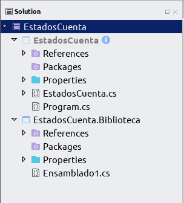
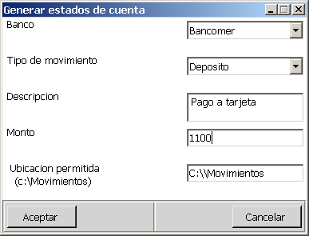
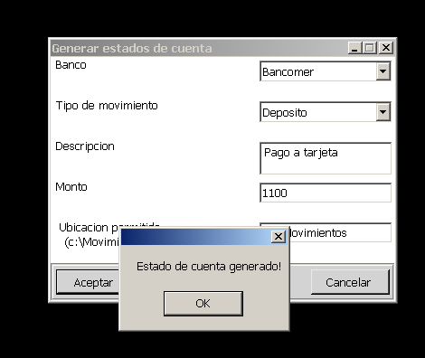
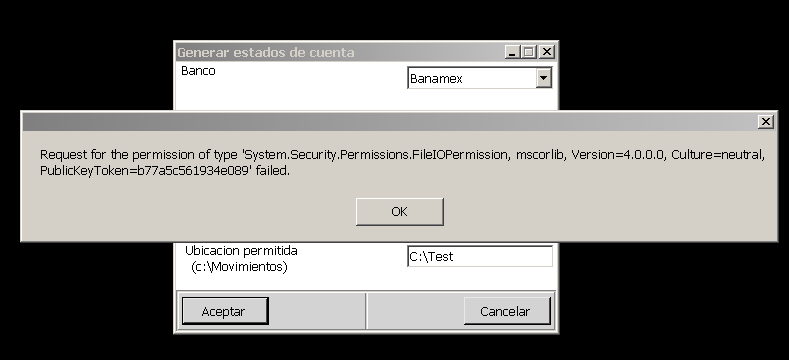

# Code Access Security CAS, la seguridad en el código para .NET

CAS (Code Access Security), es la forma en que los ensamblados solicitan permisos para acceder a ciertos recursos para su ejecución en el CLR, esto proporciona seguridad a nivel código,como una forma complementaria y adicional a la seguridad del sistema operativo.

Esta seguridad debe estar presente sobre todo si de desarrollan componentes, plugins, add-ons o juegos que serán ejecutados en diferentes ambientes que no conocemos ni controlamos. Señalo que esta seguridad es complementaria y en ningún momento deberá reemplazar la seguridad del sistema operativo. Para explicar voy a usar un ejemplo, un banco nos solicito realizar un aplicación donde el usuario genera unos archivos de estados de cuenta esta aplicación en un diseño inicial esta compuesta por un formulario y un ensamblado que se encarga de generar el estado de cuenta en un archivo XML.

 
Obviamente una aplicación de esta naturaleza, necesitaría una disciplina de análisis y diseño, pero para fines ilustrativos, logramos llegar a la etapa de construcción sin la utilización del CAS.

Como un sencillo ejemplo de la utilización de permisos mediante CAS se puede descargar este proyecto.

La solución de ejemplo se muestra más o menos así:

Fig 1. Solución para desmostrar uso de código seguro en C#.

La operación de la aplicación consiste que cuando el usuario presione el botón de generar, se generaría un archivo XML en una carpeta restringida solamente para la aplicacion si se trata de escribir en otra ubicación que no sea la predeterminada .

Fig 2. La aplicación de ejemplo.

Fig 3. La aplicación generando archivos utilizando la ubicación permitida.

La aplicación se ejecuta sin ningún problema hasta que se trate de generar los archivos en una ubicación que no es la ruta predeterminada indicada por por la aplicacion, hasta aqui el sistema operativo no indica ninguna excepción en las bitácoras de seguridad, pero debido a los permisos del CAS que no permiten que la biblioteca escriba en otra ubicación que no sea la indicada en su clase <b>FileIOPermissionAttribute</b> la aplicación no escribirá ningún archivo y lanzará una excepcion del tipo <b>SecurityException</b>.

Fig 3. Configuramos la aplicación para escribir en otra ubicación que no es la permitida.

Fig 4. Lanza una excepción si se intenta escribir en otra ubicación.

Si revisamos el código de la biblioteca proyecto [EstadosCuenta.biblioteca] observamos que el método esta implementado para generar exclusivamente los archivos bajo una carpeta llamada [Movimientos] en la partición [C:\\] y que la protección del ensamblado no dependerá de las validaciones que implementemos en la capa de presentación sino en el ensamblado mismo, por eso al invocar el método y pasarle cómo parámetro una ruta que no sea la predeterminada, este ensamblado solo escribirá en donde se le haya indicado internamente en el código.

¿Cómo podemos evitar que el código de un ensamblado realice operaciones para las que no fue diseñado?

La respuesta sin duda alguna es uno de los objetivos del CAS. Usando CAS podemos evitar que un usuario o un proceso autenticado utilice los métodos del ensamblado para realizar acciones que no están consideradas en la lógica del programa. Para lograr ese objetivo CAS utiliza permisos encapsulados como objetos que pueden ser usados a nivel de métodos o ensamblados, estos permisos pueden ser de manera declarativa usados atributos dentro del código, en este ejemplo utilizamos un permiso de forma declarativa para el método que genera los estados de cuenta.

Los permisos representan acciones que son revisadas cada vez que el CLR carga el ensamblado para ejecutarse, estos permisos son controlados por el CAS.
<ul>
<li><b>UIPermission:</b></li> Controla la manipulación a la interfaz de usuario y el portapapeles.
<li><b>ResourcePermissionBase:</b></li> Controla el acceso a los recursos de Windows.
<li><b>RegistryPermission:</b></li> Controla el acceso al Registro de Windows.
<li><b>ReflectionPermission:</b></li> Controla el acceso a la funcionalidad de la reflexión proporcionada por el CLR.
<li><b>IsolatedStoragePermission:</b></li> Controla el acceso a isolated storage.
<li><b>FileIOPermission:</b></li> Controla el acceso de escritura o lectura al disco duro.
<li><b>FileDialogPermission:</b></li> Controla el acceso a archivos o carpetas.
<li><b>EnviromentPermission:</b></li> Controla el acceso a leer, modificar y crear variables de ambiente.
</ul>
Como nuestro ensamblado esta protegido por la seguridad del CAS y no depende de la validación que implementen las clases que invoquen sus métodos. Siempre es recomendable habilitar la seguridad del CAS con el siguiente comando.

<tt>caspol -s on</tt>
